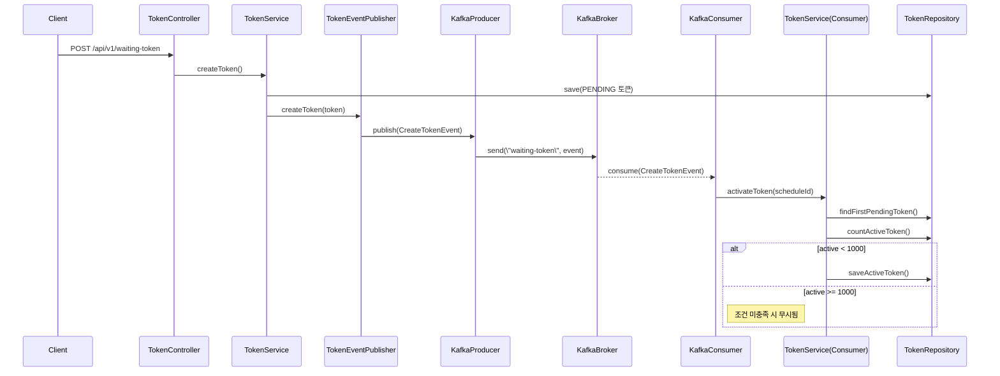

# Kafka를 활용한 대기열 토큰 프로세스 개선 보고서

## 목적

기존에는 `@Scheduled` 방식으로 10초마다 전체 콘서트 스케줄을 순회하며 `PENDING` 토큰을 `ACTIVE` 상태로 전환하고 있었습니다.  
이 방식은 다음과 같은 한계를 가졌습니다:

- 전체 스케줄 탐색으로 인한 리소스 낭비
- 실시간 처리 불가 (최대 10초 지연)
- 토큰 생성과 활성화 간 결합 부족
- 순차 처리 보장이 어려움

이를 개선하기 위해 Kafka를 도입하여 **이벤트 기반 비동기 토큰 활성화 시스템**으로 변경했습니다.

---

## 개선 후 아키텍처 개요

- 사용자가 대기열에 진입하면 즉시 `CreateTokenEvent` 를 발행합니다.
- Kafka 토픽(`waiting-token`)으로 메시지를 전송합니다.
- 컨슈머는 순차적으로 메시지를 수신하여 토큰을 활성화합니다.

---

## 비즈니스 시퀀스 다이어그램

## Kafka 구성 요약

| 항목              | 값 또는 설명                                      |
|-------------------|----------------------------------------------|
| **Topic 이름**     | `waiting-token`                              |
| **파티션 수**      | 1개                                           |
| **파티셔닝 기준**  | 없음 (단일 파티션, 순차 처리 목적)                        |
| **프로듀서**       | `KafkaTokenProducer` (`CreateTokenEvent` 발행) |
| **컨슈머 그룹**    | `token-activate`                             |
| **컨슈머 수**      | 1명 (단일 스레드, 순차 처리 전제)                        |
| **오프셋 커밋 방식** | 자동 커밋 비활성화 + 수동 커밋 (`AckMode.RECORD`)        |

## 🔁 기존 방식 vs 개선 방식

| 항목                   | 기존 방식 (`@Scheduled`)                         | 개선 방식 (`Kafka 이벤트 기반`)                   |
|------------------------|--------------------------------------------------|--------------------------------------------------|
| **토큰 활성화 시점**      | 10초 간격 스케줄러에 의해 처리                      | 토큰 발급 시점에 즉시 이벤트 발행 및 처리         |
| **처리 흐름 제어**        | 전체 스케줄 탐색 후 조건에 따라 처리                | 토큰 단위 메시지 기반 개별 처리                   |
| **순차 처리 보장**        | 없음 (멀티 스케줄 순회 및 조건 분기)                 | 단일 컨슈머를 통한 순차 처리 보장                 |
| **확장성**              | 단일 프로세스 내 스케줄러에 의존                    | Kafka 컨슈머 수평 확장 가능 (향후 가능성 확보)     |
| **리소스 효율성**        | 전체 스케줄을 매번 탐색하여 비효율적                 | 필요한 메시지만 소비하여 자원 효율 우수            |
| **실시간성**            | 최대 10초 지연 발생                                | 거의 실시간에 가까운 처리                         |

## 도입 효과 요약
- 실시간성 강화: 토큰 생성 직후 바로 활성화 이벤트 처리 가능
- 리소스 절감: 전체 스케줄을 불필요하게 순회하지 않음
- 구조 분리: 발급과 활성화 로직이 명확하게 분리되어 유지보수성 향상
- 향후 확장 기반 마련: 파티션 기반 확장 및 장애 복원 기능 추가 가능

## 현재 한계 및 고려사항

| 한계점                           | 설명 |
|----------------------------------|------|
| **파티션이 1개만 존재함**            | 모든 Kafka 메시지가 하나의 파티션에 몰려 단일 컨슈머에서 순차 처리됨. 스케줄별 병렬 처리는 불가능한 구조 |
| **스케줄 ID 기반 파티셔닝 미사용**   | `key = scheduleId` 등의 파티셔닝 전략을 아직 적용하지 않아 콘서트 단위 분산 처리 불가 |
| **활성화 한도 초과 시 무처리**       | `activeCount >= 1000`인 경우 메시지는 그냥 무시되며 재시도나 큐 대기는 발생하지 않음 |
| **Kafka 재시도 로직 미구현**         | 실패 시 재전송이나 back-off 처리가 없어 메시지 손실 가능성 존재 |
