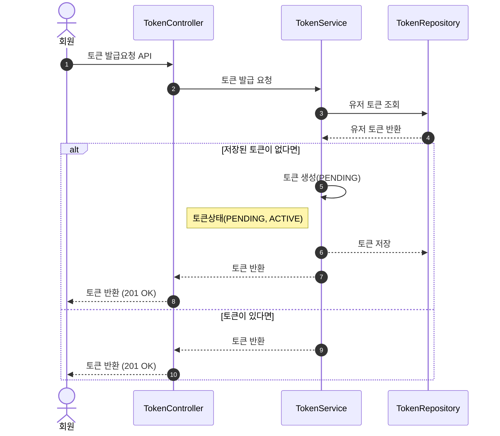
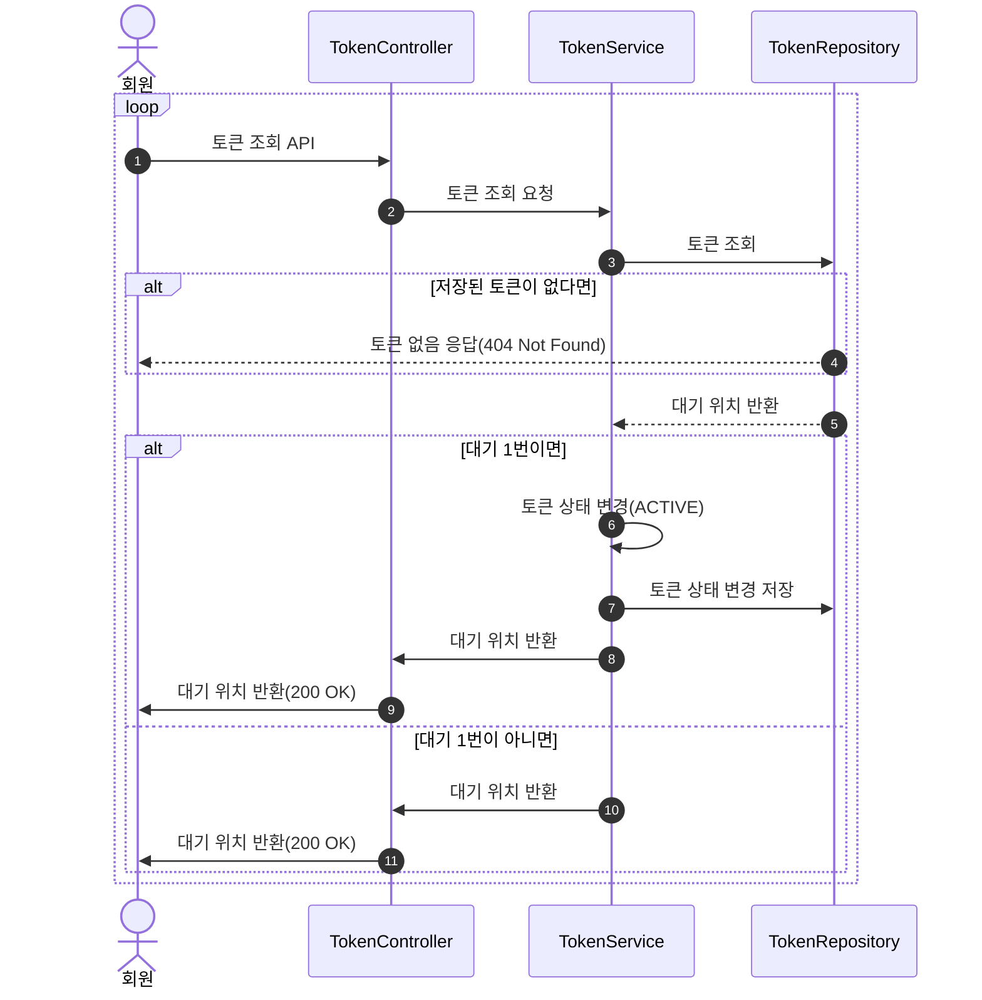
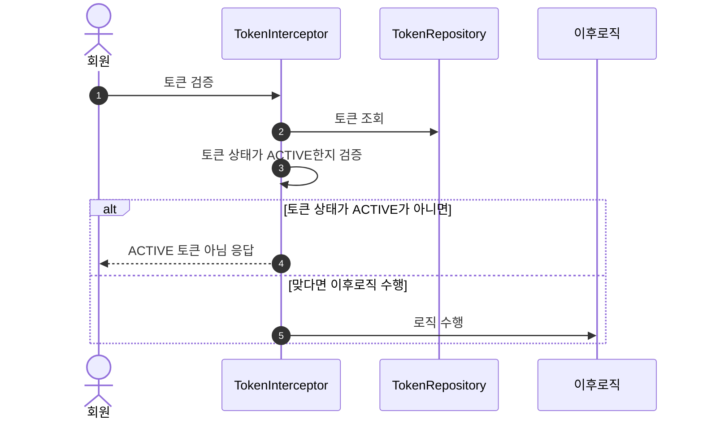
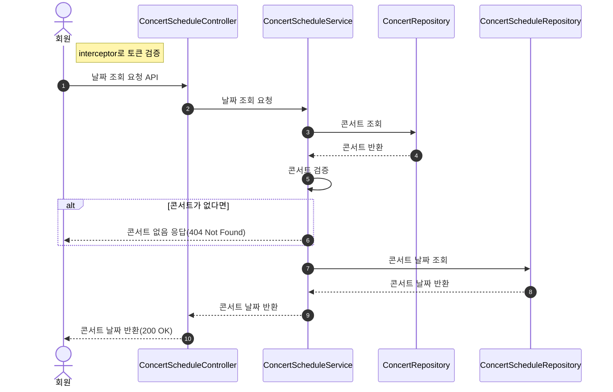
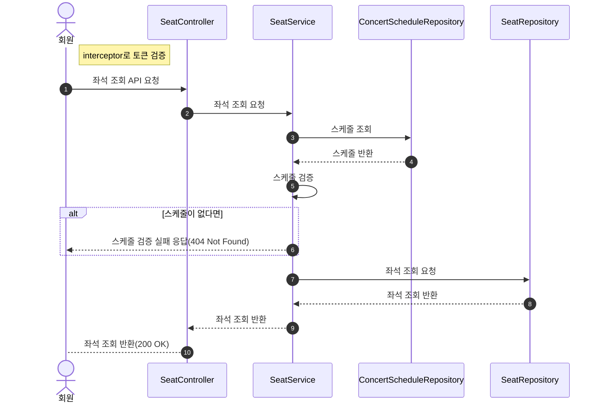
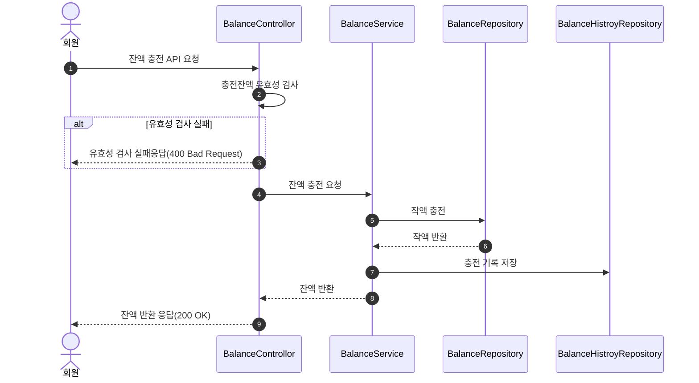
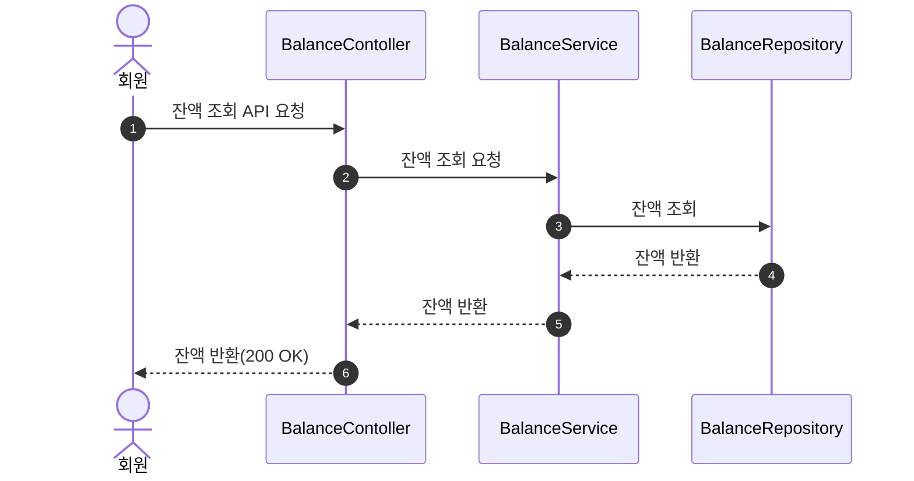
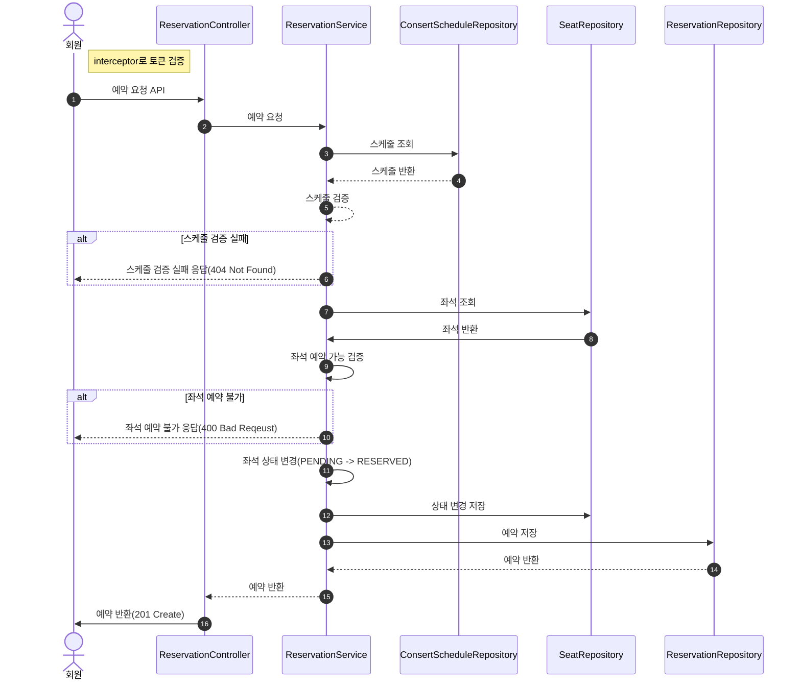
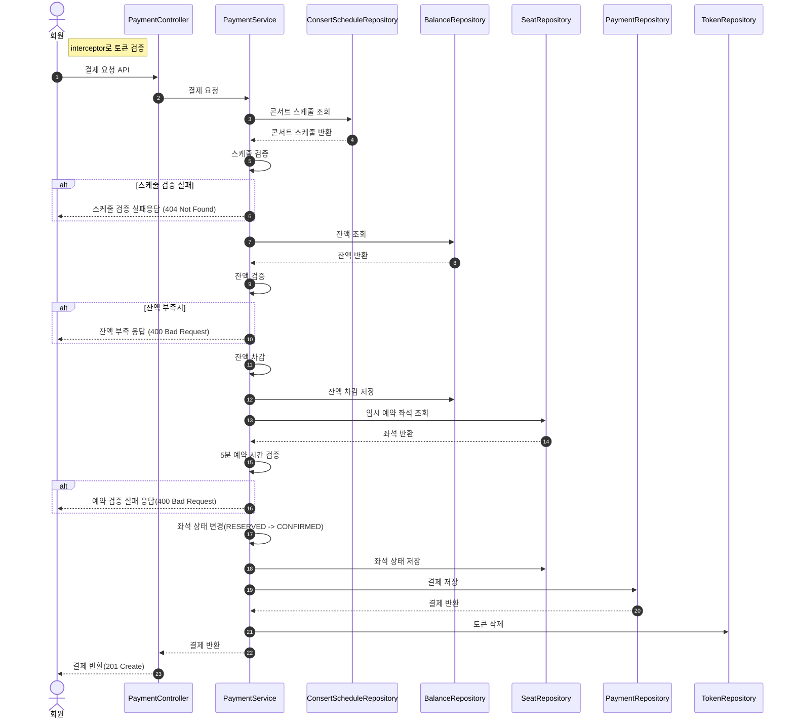
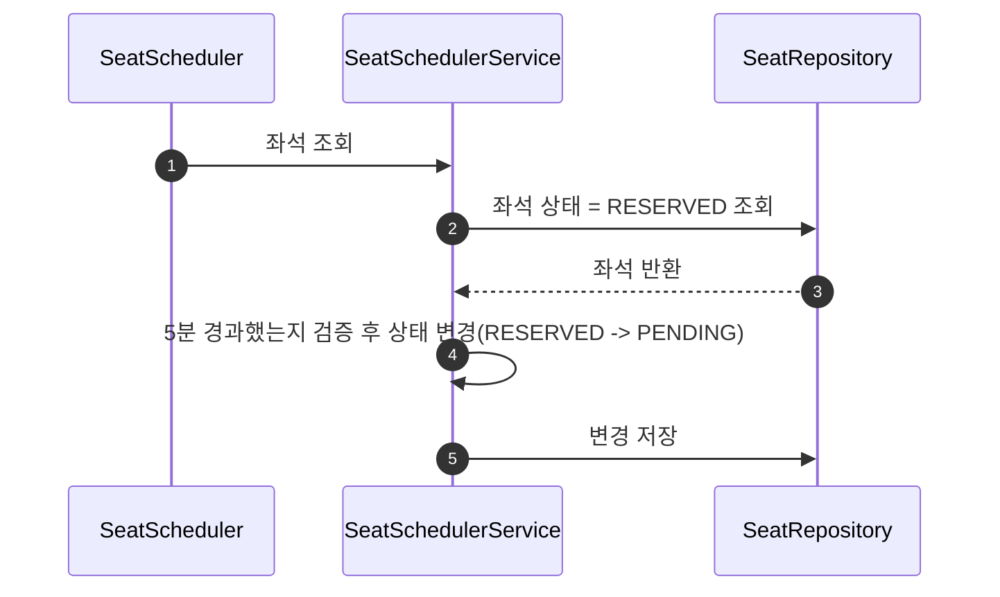

## 시퀀트 다이어그램

---

### 대기열 토큰 생성 API

---

### 대기열 조회 API(Polling)

---

### 공통 토큰 검증 Interceptor 시퀀스

---

### 예약 가능 날짜 조회 API

---

### 예약 가능 좌석 조회 API

---

### 잔액 충전 API

---

### 잔액 조회 API

---

### 좌석 예약 요청 API

--- 

### 결제 API

### 예약 좌석 5분 상태 변경 스케줄러

