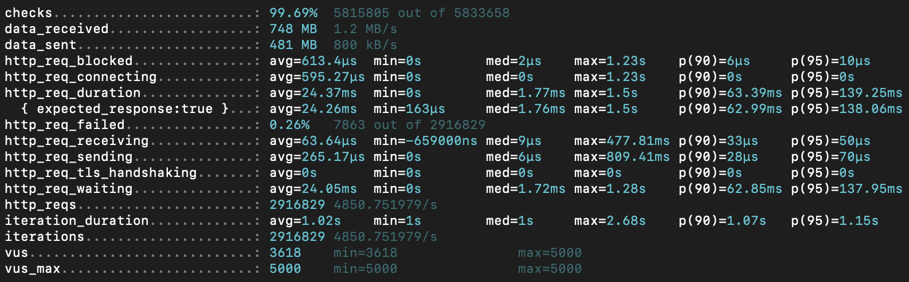

# 1. 캐시란 무엇인가?
캐시란 자주 사용되거나 접근 속도가 중요한 데이터를 보다 빠르게 제공하기 위해 임시로 저장해두는 
고속 저장소를 말하며, 일반적으로 메모리나 분사 캐시에 데이터를 저장하여 데이터베이스나 
원본 시스템에 대한 전급 비용을 줄이고 전체 시스템의 성능을 향상시키는 역할을 말한다.

---

# 2. 캐시가 필요한 이유
- 동일한 요청이 반복될 때 DB의 부하를 줄이고 응답 속도 향상
- 정적이거나 일정 주기로 갱신되는 데이터에 적합

---

# 3. 메모리 캐시 vs 분산 캐시
| 구분 | 메모리 캐시 (In-Memory Cache) | 분산 캐시 (Distributed Cache) |
|------|-------------------------------|-------------------------------|
| **저장 위치** | 애플리케이션 JVM 내부 (Heap) | 외부 시스템 (예: Redis, Memcached) |
| **속도** | 매우 빠름 (JVM 메모리 접근) | 상대적으로 느림 (네트워크 I/O) |
| **데이터 공유** | 단일 인스턴스에서만 사용 가능 | 여러 서버 간 데이터 공유 가능 |
| **확장성** | 서버 개수 늘어나면 데이터 일관성 깨짐 | 수평 확장 용이 (클러스터 지원) |
| **복잡도** | 구현 간단 | 별도 운영 필요 (Redis 설치, 모니터링 등) |
| **지속성** | 서버 종료 시 데이터 손실 | TTL, 영속성 설정 가능 |
| **적합한 상황** | - 자주 변경되지 않는 데이터 - 단일 인스턴스 환경 - 캐시 재생성이 쉬운 데이터 | - 다중 인스턴스 환경 - 고가용성 요구 - 모든 서버가 동일한 캐시를 공유해야 할 때 |
| **대표 기술** | Caffeine, Guava | Redis, Memcached |
---

# 4. 프로젝트 내 캐시 전략
## 4.1 문제 식별
- 콘서트 스케줄 조회
  - 콘서트 스케줄 조회는 좌석 예약을 진행하기위해 필수 적으로 조회되기때문에 인텍스를 설정하였다고 하지만 많은 사용자가 DB를 조회하므로 부하가 심할거라 판단
  - 그리고 콘서트 스케줄은 잘 변하지 않는 데이터이기때문에 캐시를 적용하는데 적합하다고 판단

## 4.2 분석
- 콘서트 스케줄 조회
  - 콘서트 스케줄은 사용자 요청 시마다 동일한 데이터를 반복적으로 조회하게 되며, 트래픽이 몰리는 경우 DB 커넥션 고갈 및 쿼리 병목이 발생할 수 있음.
  - 데이터 변경 주기가 거의 없어 정적 콘텐츠에 가까우며, 동일한 키로 접근 가능
  - 따라서 변경 가능성이 낮고 접근 빈도가 높은 데이터의 특성상 캐싱을 통해 조회 성능 개선 및 DB 부하 분산이 효과적이라고 판단

## 4.3 해결 방안
### 4.3.1 Redis 캐시 적용
- spring-boot-starter-cache, spring-data-redis 의존성 추가
- RedisCacheManager를 Bean으로 등록하고, TTL(Time To Live)을 2분으로 설정하여 캐시 갱신 주기 조절
- @Cacheable 애노테이션을 통해 콘서트 스케줄 조회 서비스에 캐시 적용
- 캐시 키는 concertId:startDate:endDate 조합으로 구성하여 고유성과 식별력을 확보

Redis 캐시 시퀀스 다이어그램

### 4.3.2 K6 부하테스트
레디스 캐시를 적용하고 K6로 간단한 부하테스트 진행

- **총 요청 수**: 2,726,364건 (평균 4,536 req/s)
- **평균 응답 시간 (`http_req_duration`)**: 94.91ms
  - 대부분 100ms 이내에 응답
  - 95% 사용자가 390ms 이내에 응답을 받음
- **실패율 (`http_req_failed`)**: 0.26%
  - 거의 모든 요청이 성공적으로 처리됨
- **가상 유저 수 (`vus`)**: 평균 1,559명 사용 (최대 5,000명 중)
  - 많은 유저가 동시에 요청을 처리할 수 있었음
- **평균 대기 시간 (`http_req_waiting`)**: 94.61ms
  - 실제 서버 처리 시간 기준으로도 매우 양호

부하 테스트를 진행하면서 MySQL Workbench를 통해 실시간 모니터링

- Redis 캐시의 만료 시간이 도래했을 때, 다수의 요청이 동시에 DB를 조회하게 되어 **순간적인 부하 급증 현상(Cache Stampede)** 발생
- 이로 인해 **SQL 실행 수가 일시적으로 급상승**하는 패턴이 관측됨
- 캐시 미스 시 다수의 요청이 동시에 DB로 몰리는 것을 방지할 **추가적인 대응 전략**이 필요함
  - 예: 로컬 캐시 추가, 캐시 프리로딩, 스탬피드 방지 락, 백그라운드 리프레시 등

### 4.3.3 Caffeine 캐시 + Redis 캐시 적용 (멀티레벨 캐싱)
- Caffeine 캐시는 JVM 내부에 존재하는 고속 로컬 캐시로, 요청 처리 속도를 극대화할 수 있음
- Redis는 공유 분산 캐시로, 서버 간 일관된 데이터를 제공할 수 있음
- `CompositeCacheManager`를 통해 Caffeine → Redis 순으로 조회되는 **2단계 캐시 구조** 구성
- Caffeine 캐시는 TTL 30초, Redis 캐시는 TTL 2분으로 설정하여 효율적인 데이터 유지 및 자원 절약을 고려
- `@Cacheable` 애노테이션으로 기존 서비스 로직에 동일하게 적용 가능
- 주요 효과:
  - 대부분의 요청은 Caffeine에서 처리되어 응답 속도 향상
  - Caffeine 캐시 미스 시 Redis에서 보완 → DB 접근 최소화
  - Redis TTL만료로 발생하는 **Cache Stampede 현상 완화**

### 4.3.3 Caffeine 캐시 + Redis 캐시 K6 부하테스트

- **총 요청 수**: 2,916,829건 (평균 4,850 req/s)
- **평균 응답 시간 (`http_req_duration`)**: 24.37ms
  - 대부분 요청이 100ms 이내에 처리됨
  - 95% 사용자가 139ms 이내에 응답을 받음
- **실패율 (`http_req_failed`)**: 0.26%
  - 거의 모든 요청이 정상 처리됨
- **가상 유저 수 (`vus`)**: 평균 3,618명 사용 (최대 5,000명 중)
  - Redis만 사용했을 때보다 더 많은 사용자가 동시에 요청 가능
- **평균 대기 시간 (`http_req_waiting`)**: 24.05ms
  - 서버 실제 처리시간 기준으로 매우 우수한 성능
- **전송량**
  - 수신 데이터: 748MB, 발신 데이터: 481MB
  - 처리 효율이 높음에도 불구하고 응답 데이터 전송은 안정적으로 유지됨

- 로컬 캐시(Caffeine)와 Redis를 함께 사용한 경우, **SQL 실행 수와 네트워크 지표가 순간적으로 더 많이 튀는 현상**이 나타남
  - 이는 TTL 만료 시 Redis까지 미스가 발생해 일시적으로 DB 조회가 이루어졌기 때문
- 하지만 이 튀는 구간은 매우 짧고 분산된 요청에 의해 부하가 빠르게 흡수되는 구조
- 실제 부하 테스트 결과에서도 **전체 평균 응답 시간과 실패율이 Redis 단독 사용보다 더 우수한 성능을 보임**
- 즉, 로컬 캐시를 활용한 2단계 캐시는 **Redis의 부하를 줄이면서 전체 시스템 안정성과 응답 속도를 향상**시키는 데 효과적임

### 4.3.4 결과
| 구분                  | 캐시 미적용                     | Redis 캐시만 사용               | Redis + 로컬 캐시 사용          |
|---------------------|-------------------------------|-------------------------------|-------------------------------|
| **총 요청 수**        | 281,483                       | 2,726,364                     | 2,916,829                     |
| **평균 응답 시간**    | 9.74s                         | 94.91ms                       | 24.37ms                       |
| **95% 응답 시간**     | 11.51s                        | 390.03ms                      | 138.06ms                      |
| **평균 대기 시간**    | 9.74s                         | 94.61ms                       | 24.05ms                       |
| **요청 실패율**       | 2.51%                         | 0.26%                         | 0.26%                         |
| **초당 처리량 (req/s)** | 459 req/s                     | 4,536 req/s                   | 4,851 req/s                   |
| **평균 VUs**         | 213                           | 1,559                         | 3,618                         |
| **평균 iteration 시간** | 10.76s                        | 1.1s                          | 1.02s                         |

- 캐시 미적용 시 응답 시간이 심각하게 높고, 실패율도 높음 → 대규모 트래픽 대응 불가능
- Redis 캐시만 사용하면 성능이 대폭 개선되며, 응답 시간도 100ms 내외로 양호함
- Redis + 로컬 캐시 병행 시 응답 시간은 더 빨라지고 처리량도 증가함 → 캐시 히트율이 매우 높아진 것으로 해석됨
- 결과적으로, 2단계 캐시 전략이 가장 안정적이고 효율적인 구조임을 보여줌

---

## 5. 결론

이번 프로젝트에서는 **콘서트 스케줄 조회 API의 성능 최적화**를 위해 다양한 캐싱 전략을 설계하고 실제 부하 테스트를 통해 효과를 검증하였다. 특히 데이터의 정적 특성과 반복 조회 특성을 고려하여 캐시가 적절한 해결책이라는 판단 아래 다음과 같은 방향으로 개선을 진행하였다.

- **단일 Redis 캐시 사용**만으로도 평균 응답 시간과 DB 부하를 크게 줄일 수 있었으나, TTL 만료 시 다수의 요청이 DB로 몰리는 *Cache Stampede* 문제가 발생
- 이를 완화하기 위해 **Caffeine 로컬 캐시와 Redis 분산 캐시를 병렬 적용한 멀티 레벨 캐시 구조**를 도입
- 대부분의 요청은 JVM 내부의 로컬 캐시에서 처리되어 속도가 매우 향상되고, Redis는 보조 역할로써 DB 접근을 더욱 줄이는 구조
- 실제 부하 테스트 결과에서도 **2단계 캐시 구조가 가장 낮은 응답 시간과 가장 높은 처리량을 기록**

> 단, **캐시는 성능 개선의 ‘최후 수단’이지 시작점이 아니라고 생각한다.**
> 캐시 적용에 앞서 반드시 **인덱스 최적화, N+1 쿼리 제거, 불필요한 조회 제거 등 쿼리 자체의 성능 개선이 선행**되어야 한다.
> 쿼리 튜닝 없이 캐시에만 의존할 경우, 구조가 복잡해지고 유지보수가 어려워질 수 있다.
